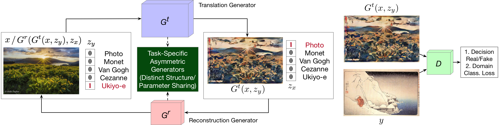
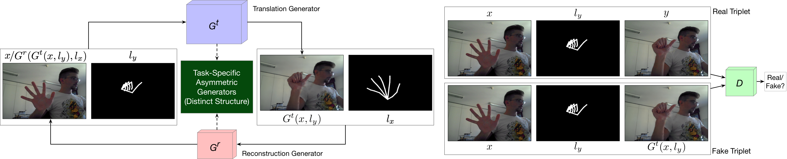

[](https://github.com/Ha0Tang/GestureGAN/blob/master/LICENSE.md)


[]((https://github.com/Ha0Tang/GestureGAN/graphs/commit-activity))


<!-- [](https://paperswithcode.com/sota/gesture-to-gesture-translation-on-ntu-hand?p=gesturegan-for-hand-gesture-to-gesture)
[](https://paperswithcode.com/sota/gesture-to-gesture-translation-on-senz3d?p=gesturegan-for-hand-gesture-to-gesture) -->

<!-- 
GestureGAN for hand gesture-to-gesture tranlation task. Given an image and some novel hand skeletons, GestureGAN is able
to generate the same person but with different hand gestures.


GestureGAN for cross-view image tranlation task. Given an image and some novel semantic maps, GestureGAN is able
to generate the same scene but with different viewpoints. -->

# AsymmetricGAN for Image-to-Image Translation

## AsymmetricGAN Framework for Multi-Domain Image-to-Image Translation


## AsymmetricGAN Framework for Hand Gesture-to-Gesture Translation


### [Conference paper](https://arxiv.org/abs/1901.04604) | [Project page (Conference paper)](http://disi.unitn.it/~hao.tang/project/G2GAN.html) | [Slides](http://disi.unitn.it/~hao.tang/uploads/slides/G2GAN_ACCV18.pptx) | [Poster](http://disi.unitn.it/~hao.tang/uploads/posters/G2GAN_ACCV18.pdf)

Dual Generator Generative Adversarial Networks for Multi-Domain Image-to-Image Translation.<br>
[Hao Tang](http://disi.unitn.it/~hao.tang/)<sup>1</sup>, [Dan Xu](http://www.robots.ox.ac.uk/~danxu/)<sup>2</sup>, [Wei Wang](https://weiwangtrento.github.io/)<sup>3</sup>, [Yan Yan](https://userweb.cs.txstate.edu/~y_y34/)<sup>4</sup> and [Nicu Sebe](http://disi.unitn.it/~sebe/)<sup>1</sup>. <br> 
<sup>1</sup>University of Trento, Italy, <sup>2</sup>University of Oxford, UK, <sup>3</sup>EPFL, Switzerland, <sup>4</sup>Texas State University, USA.<br>
In ACCV 2018 (**Oral**).<br>
The repository offers the official implementation of our paper in PyTorch.

### [License](./LICENSE.md)

Copyright (C) 2019 University of Trento, Italy.

All rights reserved.
Licensed under the [CC BY-NC-SA 4.0](https://creativecommons.org/licenses/by-nc-sa/4.0/legalcode) (**Attribution-NonCommercial-ShareAlike 4.0 International**)

The code is released for academic research use only. For commercial use, please contact [hao.tang@unitn.it](hao.tang@unitn.it).

## Installation

Clone this repo.
```bash
git clone https://github.com/Ha0Tang/AsymmetricGAN
cd AsymmetricGAN/
```

This code requires PyTorch 0.4.1 and python 3.6+. Please install dependencies by
```bash
pip install -r requirements.txt (for pip users)
```
or 

```bash
./scripts/conda_deps.sh (for Conda users)
```

To reproduce the results reported in the paper, you would need two NVIDIA GeForce GTX 1080 Ti GPUs or two NVIDIA TITAN Xp GPUs.

## Dataset Preparation

For hand gesture-to-gesture translation task, we use NTU Hand Digit and Creative Senz3D datasets.
Both datasets must be downloaded beforehand. Please download them on the respective webpages. In addition, follow [GestureGAN](https://github.com/Ha0Tang/GestureGAN) to prepare both datasets. Please cite their papers if you use the data. 

**Preparing NTU Hand Digit Dataset**. The dataset can be downloaded in this [paper](https://rose.ntu.edu.sg/Publications/Documents/Action%20Recognition/Robust%20Part-Based%20Hand%20Gesture.pdf). After downloading it we adopt [OpenPose](https://github.com/CMU-Perceptual-Computing-Lab/openpose) to generate hand skeletons and use them as training and testing data in our experiments. Note that we filter out failure cases in hand gesture estimation for training and testing. Please cite their papers if you use this dataset. Train/Test splits for Creative Senz3D dataset can be downloaded from [here](https://github.com/Ha0Tang/GestureGAN/tree/master/datasets/ntu_split).

**Preparing Creative Senz3D Dataset**. The dataset can be downloaded [here](https://lttm.dei.unipd.it//downloads/gesture/#senz3d). After downloading it we adopt [OpenPose](https://github.com/CMU-Perceptual-Computing-Lab/openpose) to generate hand skeletons and use them as training data in our experiments. Note that we filter out failure cases in hand gesture estimation for training and testing. Please cite their papers if you use this dataset. Train/Test splits for Creative Senz3D dataset can be downloaded from [here](https://github.com/Ha0Tang/GestureGAN/tree/master/datasets/senz3d_split). 

**Preparing Your Own Datasets**. Each training sample in the dataset will contain {Ix,Iy,Cx,Cy}, where Ix=image x, Iy=image y, Cx=Controllable structure of image x, and Cy=Controllable structure of image y.
Of course, you can use AsymmetricGAN for your own datasets and tasks.

## Generating Images Using Pretrained Model

Once the dataset is ready. The result images can be generated using pretrained models.

1. You can download a pretrained model (e.g. ntu_asymmetricgan) with the following script:

```
bash ./scripts/download_asymmetricgan_model.sh ntu_asymmetricgan
```
The pretrained model is saved at `./checkpoints/[type]_pretrained`. Check [here](https://github.com/Ha0Tang/GestureGAN/blob/master/scripts/download_asymmetricgan_model.sh) for all the available AsymmetricGAN models.

2. Generate images using the pretrained model.

For NTU Dataset:
```bash
python test.py --dataroot [path_to_NTU_dataset] \
	--name ntu_asymmetricgan_pretrained \
	--model asymetricgan \
	--which_model_netG resnet_9blocks \
	--which_direction AtoB \
	--dataset_mode aligned \
	--norm instance \
	--gpu_ids 0 \
	--batchSize 4 \
	--loadSize 286 \
	--fineSize 256 \
	--no_flip
```

For Senz3D Dataset:
```bash
python test.py --dataroot [path_to_Senz3D_dataset] \
	--name senz3d_asymmetricgan_pretrained \
	--model asymetricgan \
	--which_model_netG resnet_9blocks \
	--which_direction AtoB \
	--dataset_mode aligned \
	--norm instance \
	--gpu_ids 0 \
	--batchSize 4 \
	--loadSize 286 \
	--fineSize 256 \
	--no_flip
```

If you are running on CPU mode, change `--gpu_ids 0` to `--gpu_ids -1`.
    
3. The outputs images are stored at `./results/[type]_pretrained/` by default. You can view them using the autogenerated HTML file in the directory.

## Training New Models

New models can be trained with the following commands.

1. Prepare dataset. 

2. Train.

For NTU dataset:
```bash
export CUDA_VISIBLE_DEVICES=3,4;
python train.py --dataroot ./datasets/ntu \
	--name ntu_gesturegan_twocycle \
	--model gesturegan_twocycle \
	--which_model_netG resnet_9blocks \
	--which_direction AtoB \
	--dataset_mode aligned \
	--norm instance \
	--gpu_ids 0,1 \
	--batchSize 4 \
	--loadSize 286 \
	--fineSize 256 \
	--no_flip \
	--lambda_L1 800 \
	--cyc_L1 0.1 \
	--lambda_identity 0.01 \
	--lambda_feat 1000 \
	--display_id 0 \
	--niter 10 \
	--niter_decay 10
```

For Senz3D dataset:
```bash
export CUDA_VISIBLE_DEVICES=5,7;
python train.py --dataroot ./datasets/senz3d \
	--name senz3d_gesturegan_twocycle \
	--model gesturegan_twocycle \
	--which_model_netG resnet_9blocks \
	--which_direction AtoB \
	--dataset_mode aligned \
	--norm instance \
	--gpu_ids 0,1 \
	--batchSize 4 \
	--loadSize 286 \
	--fineSize 256 \
	--no_flip \
	--lambda_L1 800 \
	--cyc_L1 0.1 \
	--lambda_identity 0.01 \
	--lambda_feat 1000 \
	--display_id 0 \
	--niter 10 \
	--niter_decay 10
```

There are many options you can specify. Please use `python train.py --help`. The specified options are printed to the console. To specify the number of GPUs to utilize, use `export CUDA_VISIBLE_DEVICES=[GPU_ID]`.

To view training results and loss plots on local computers, set `--display_id` to a non-zero value and run `python -m visdom.server` on a new terminal and click the URL [http://localhost:8097](http://localhost:8097/).
On a remote server, replace `localhost` with your server's name, such as [http://server.trento.cs.edu:8097](http://server.trento.cs.edu:8097).

### Can I continue/resume my training? 
To fine-tune a pre-trained model, or resume the previous training, use the `--continue_train --which_epoch <int> --epoch_count<int+1>` flag. The program will then load the model based on epoch `<int>` you set in `--which_epoch <int>`. Set `--epoch_count <int+1>` to specify a different starting epoch count.


## Testing

Testing is similar to testing pretrained models.

For NTU dataset:
```bash
python test.py --dataroot ./datasets/ntu \
	--name ntu_gesturegan_twocycle \
	--model gesturegan_twocycle \
	--which_model_netG resnet_9blocks \
	--which_direction AtoB \
	--dataset_mode aligned \
	--norm instance \
	--gpu_ids 0 \
	--batchSize 4 \
	--loadSize 286 \
	--fineSize 256 \
	--no_flip
```

For Senz3D dataset:
```bash
python test.py --dataroot ./datasets/senz3d \
	--name senz3d_gesturegan_twocycle \
	--model gesturegan_twocycle \
	--which_model_netG resnet_9blocks \
	--which_direction AtoB \
	--dataset_mode aligned \
	--norm instance \
	--gpu_ids 0 \
	--batchSize 4 \
	--loadSize 286 \
	--fineSize 256 \
	--no_flip
```

Use `--how_many` to specify the maximum number of images to generate. By default, it loads the latest checkpoint. It can be changed using `--which_epoch`.

## Code Structure

- `train.py`, `test.py`: the entry point for training and testing.
- `models/asymmetricgan_model.py`: creates the networks, and compute the losses.
- `models/networks/`: defines the architecture of all models for GestureGAN.
- `options/`: creates option lists using `argparse` package.
- `data/`: defines the class for loading images and controllable structures.

## Evaluation Code

We use several metrics to evaluate the quality of the generated images:
- [Fréchet Inception Distance (FID)](https://github.com/bioinf-jku/TTUR) 
- [PSNR](https://github.com/Ha0Tang/GestureGAN/blob/master/scripts/evaluation/compute_psnr.lua), need install `Lua` 
- [Fréchet ResNet Distance (FRD)](https://github.com/Ha0Tang/GestureGAN/tree/master/scripts/evaluation/FRD), need install `MATLAB 2016+`

## Citation
If you use this code for your research, please cite our papers.
```
@inproceedings{tang2018dual,
  title={Dual Generator Generative Adversarial Networks for Multi-Domain Image-to-Image Translation},
  author={Tang, Hao and Xu, Dan and Wang, Wei and Yan, Yan and Sebe, Nicu},
  booktitle={ACCV},
  year={2018}
}
```

## Acknowledgments
This source code is inspired by [Pix2pix](https://github.com/junyanz/pytorch-CycleGAN-and-pix2pix) and [GestureGAN](https://github.com/Ha0Tang/GestureGAN).

## Related Projects

- [StarGAN](https://github.com/yunjey/stargan)
- [GestureGAN](https://github.com/Ha0Tang/GestureGAN)

## Contributions
If you have any questions/comments/bug reports, feel free to open a github issue or pull a request or e-mail to the author Hao Tang ([hao.tang@unitn.it](hao.tang@unitn.it)).
